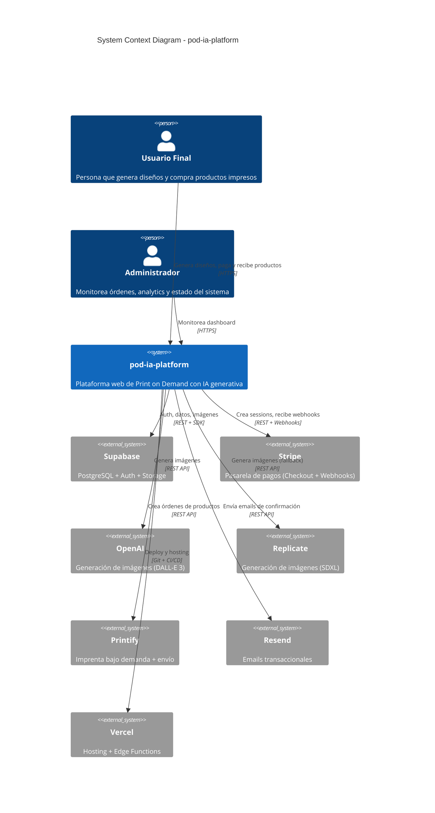
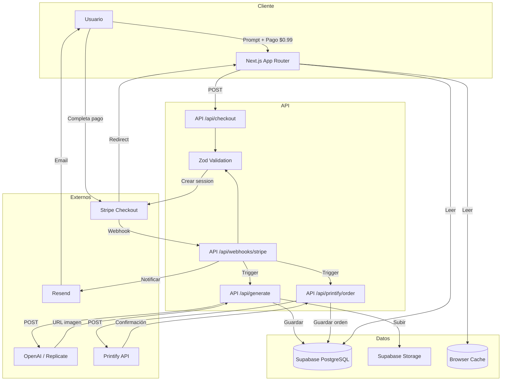
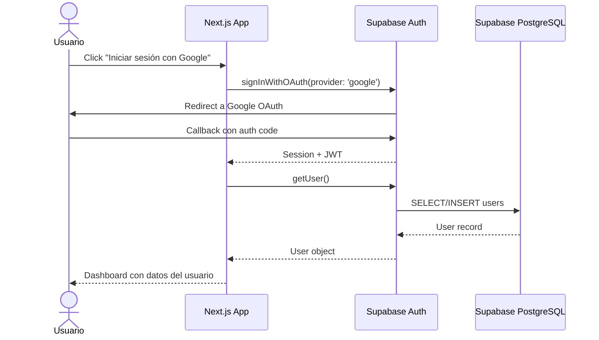

# ARCHITECTURE.md — experimentoprompt (pod-ia-platform)

> **Propósito:** Documentar decisiones técnicas, data flows y componentes del sistema.
> **Fuente:** PROJECT_DNA_EXPERIMENTOPROMPT.md (Secciones 2, 3, 5)
> **Última actualización:** 2026-06-03
> **Audiencia:** Desarrolladores, DevOps, IAs operando en el proyecto

---

## Tabla de Contenidos

1. [Decisiones Técnicas](#1-decisiones-técnicas)
2. [Diagrama de Contexto (C4 Nivel 1)](#2-diagrama-de-contexto-c4-nivel-1)
3. [Diagrama de Data Flow](#3-diagrama-de-data-flow)
4. [Diagrama de Componentes](#4-diagrama-de-componentes)
5. [Tabla de Componentes](#5-tabla-de-componentes)
6. [Flujo de Datos Detallado](#6-flujo-de-datos-detallado)
7. [API Contract (Resumen)](#7-api-contract-resumen)
8. [Decisiones Pendientes](#8-decisiones-pendientes)

---

## 1. Decisiones Técnicas

### Next.js 16 App Router → Full-Stack Unificado

**Contexto:** El proyecto requiere un frontend web interactivo + API para integraciones externas (Stripe, Printify, OpenAI). La alternativa era separar frontend (React/Vite) y backend (FastAPI/Express).

**Alternativas consideradas:**
- **React + Vite + FastAPI:** Mejor separación de concerns, más control del backend. Pero requiere 2 deploys, CORS, y más infraestructura.
- **Next.js 16 App Router:** Un solo deploy en Vercel, Server Components por defecto, API Routes integradas, edge functions. Riesgo: vendor lock-in en Vercel.

**Decisión:** Next.js 16 App Router. La velocidad de desarrollo y el hecho de que todos los servicios externos son serverless-friendly (Stripe webhooks, Printify REST, OpenAI REST) hacen que un backend tradicional no aporte ventajas significativas.

**Consecuencias:**
- ✅ Un solo repositorio, un solo deploy, menor complejidad operativa.
- ✅ Server Components reducen JavaScript enviado al cliente.
- ⚠️ Vendor lock-in en Vercel (mitigable con Docker si se migra).
- ⚠️ Webhooks deben ser rápidos (< 10s) o usar edge functions.

### Supabase (PostgreSQL + Auth + Storage) → Backend-as-a-Service

**Contexto:** Se necesita autenticación, base de datos relacional, y almacenamiento de imágenes generadas.

**Alternativas consideradas:**
- **Firebase:** Auth + Firestore + Storage. Más maduro pero NoSQL limita relaciones complejas (usuarios → diseños → órdenes).
- **Auth0 + PostgreSQL + S3:** Máxima flexibilidad pero requiere configurar y mantener 3 servicios separados.
- **Supabase:** Auth + PostgreSQL + Storage en un solo ecosistema. Plan gratis generoso.

**Decisión:** Supabase. PostgreSQL permite relaciones SQL nativas (foreign keys, joins) críticas para el modelo de datos. El plan gratis cubre el MVP sin costos.

**Consecuencias:**
- ✅ Relaciones SQL robustas: users → designs → orders.
- ✅ RLS policies integradas: seguridad a nivel de fila sin código extra.
- ✅ Storage integrado para imágenes generadas.
- ⚠️ Latencia: Supabase está en una región específica; si Vercel edge function está lejos, hay latencia de red.

### Stripe → Pasarela de Pagos

**Contexto:** Procesar pagos de $0.99 por generación y cobros de productos físicos con markup.

**Alternativas consideradas:**
- **PayPal:** Más global pero checkout UX inferior y fees más altos para micro-pagos.
- **MercadoPago:** Relevante para LATAM pero no tiene la infraestructura de webhooks y Checkout Sessions de Stripe.
- **LemonSqueezy:** Más simple pero menos control sobre webhooks y sin soporte para "cobros + órdenes físicas".

**Decisión:** Stripe. Checkout Sessions ofrecen la mejor UX de pago, webhooks son robustos y bien documentados, y el fee del 2.9% + $0.30 es aceptable para transacciones > $10.

**Consecuencias:**
- ✅ Webhooks con firma HMAC: verificación criptográfica de eventos.
- ✅ Checkout Session redirige al usuario y vuelve automáticamente.
- ⚠️ Fee fijo de $0.30 por transacción: en pagos de $0.99, el fee representa ~30% del revenue. Se mitiga con el modelo de "descuento si compra producto".

---

## 2. Diagrama de Contexto (C4 Nivel 1)



---

## 3. Diagrama de Data Flow

### Flujo Principal (Generación → Pago → Impresión)



### Flujo de Autenticación



---

## 4. Diagrama de Componentes

```mermaid
graph LR
    subgraph Frontend
        P[Pages<br/>Server Components]
        C[Client Components<br/>"use client"]
        H[Hooks<br/>useState/useEffect]
        S[Server Actions<br/>async functions]
    end
    
    subgraph API Routes
        R[Route Handlers<br/>app/api/*]
        M[Middleware<br/>proxy.ts]
        V[Zod Validators]
    end
    
    subgraph Services
        Stripe[Stripe Client]
        Supa[Supabase Client]
        AI[AI Client<br/>OpenAI/Replicate]
        Prn[Printify Client]
        Rsd[Resend Client]
    end
    
    subgraph Infraestructura
        DB[(Supabase<br/>PostgreSQL)]
        Stg[Supabase<br/>Storage]
        Cache[(Browser<br/>Cache)]
    end
    
    P --> C
    C --> H
    P --> S
    S --> R
    C --> R
    R --> M
    M --> V
    R --> Stripe
    R --> Supa
    R --> AI
    R --> Prn
    R --> Rsd
    Supa --> DB
    Supa --> Stg
    AI --> Stg
    Prn --> Stg
    C --> Cache
```

---

## 5. Tabla de Componentes

| Componente | Tecnología | Responsabilidad | Interfaz | Escalabilidad |
|---|---|---|---|---|
| **Next.js App Router** | Next.js 16 | Routing, rendering (Server/Client Components), API Routes | HTTP / JSX | Auto-scalable en Vercel |
| **Supabase Client** | `@supabase/ssr`, `@supabase/supabase-js` | Auth, DB queries, Storage uploads/downloads | SDK / REST | Serverless (auto-scalable) |
| **Stripe Client** | `stripe` (Node), `@stripe/stripe-js` | Checkout Sessions, webhook verification, refunds | REST API | External (Stripe handles scale) |
| **AI Client** | `openai`, `fetch` (Replicate) | Image generation, prompt formatting, fallback | REST API | External (OpenAI/Replicate rate limits) |
| **Printify Client** | `fetch` + TypeScript | Product creation, order placement, tracking | REST API | External (Printify handles fulfillment) |
| **Resend Client** | `resend` | Transactional emails (order confirmations) | REST API | External (Resend handles delivery) |
| **Zod Validators** | `zod` | Input validation for all API routes | TypeScript types | In-process (zero overhead) |
| **Supabase PostgreSQL** | PostgreSQL 15 | Users, designs, orders, RLS policies | SQL / REST | Managed (Supabase auto-scales) |
| **Supabase Storage** | S3-compatible | Generated image storage | REST / SDK | Managed |

---

## 6. Flujo de Datos Detallado

### Flujo: Generación de Diseño

1. Usuario escribe prompt en `app/(dashboard)/generar/page.tsx` (Client Component).
2. Frontend valida longitud y contenido del prompt (Zod schema client-side).
3. Frontend envía POST a `/api/checkout` con prompt + metadata del producto.
4. API route valida input con Zod, verifica autenticación vía Supabase session.
5. API crea Stripe Checkout Session de $0.99 con el prompt en metadata.
6. Frontend redirige a Stripe Checkout URL.
7. Usuario completa pago en Stripe.
8. Stripe envía webhook `payment_intent.succeeded` a `/api/webhooks/stripe`.
9. Webhook handler verifica firma HMAC, extrae prompt de metadata.
10. Webhook dispara generación: POST a OpenAI DALL-E 3 (o Replicate fallback).
11. Imagen generada se sube a Supabase Storage.
12. Registro de diseño se guarda en PostgreSQL (`designs` table) con `user_id`.
13. Webhook dispara creación de orden en Printify (`/api/printify/order`).
14. Orden guardada en PostgreSQL (`orders` table) con estado `pending`.
15. Email de confirmación enviado vía Resend.

### Flujo: Consulta de Historial

1. Usuario navega a `app/(dashboard)/disenos/page.tsx` (Server Component).
2. Server Component llama `lib/supabase.ts` para query `designs` table.
3. Supabase RLS policy verifica que `user_id === auth.uid()`.
4. Resultados renderizados como lista de `DesignCard` (Server Component).
5. Imágenes servidas desde Supabase Storage con URLs públicas o signed.

---

## 7. API Contract (Resumen)

| Endpoint | Método | Descripción | Auth | Estado |
|---|---|---|---|---|
| `/api/generate` | `POST` | Genera imagen con IA (después de pago) | Requiere sesión | ✅ Implementado |
| `/api/checkout` | `POST` | Crea Stripe Checkout Session de $0.99 | Requiere sesión | ✅ Implementado |
| `/api/webhooks/stripe` | `POST` | Recibe webhooks de Stripe (payment_intent.succeeded) | Firma HMAC | ✅ Implementado |
| `/api/printify/order` | `POST` | Crea orden de producto en Printify | Requiere sesión | ✅ Implementado |
| `/api/printify/order` | `GET` | Obtiene estado de orden en Printify | Requiere sesión | ⚪ Pendiente |

---

## 8. Decisiones Pendientes

| # | Decisión | Opciones | Bloqueado por | Reevaluar en |
|---|---|---|---|---|
| 1 | ¿Migrar de `@types/stripe` a tipos nativos del SDK? | Eliminar `@types/stripe` vs mantener por compatibilidad | Verificar si hay conflictos de tipos | 2026-06-10 |
| 2 | ¿Implementar caché de imágenes generadas? | Supabase Storage (ya existe) vs CDN externo (Cloudflare R2) | Costos de ancho de banda | 2026-06-17 |
| 3 | ¿Rate limiting en edge function o API route? | Vercel Edge Config vs custom middleware vs Redis | Decision sobre infraestructura | 2026-06-10 |
| 4 | ¿Soporte para múltiples idiomas? | i18n con Next.js vs mantener solo español | Demanda de usuarios | Post-launch |

---

*Fin de ARCHITECTURE.md — Decisiones técnicas y arquitectura de experimentoprompt (pod-ia-platform).*
