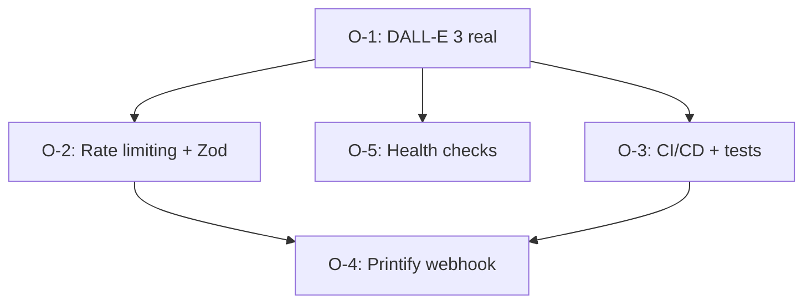

# GAPS.md — Oportunidades de Mejora

> **Propósito:** Análisis de gaps identificados por opencode para priorizar trabajo futuro.
> **Generado:** 2026-06-05
> **Fuentes:** `project-context/ROADMAP.md`, `project-context/PRODUCT_BACKLOG.md`, análisis de código

---

## Resumen

| Prioridad | Gap | Impacto | Esfuerzo | Roadmap |
|---|---|---|---|---|
| 🚨 Crítico | `lib/ai.ts` no llama a OpenAI DALL-E 3 | Máximo | Bajo | M4 |
| 🔴 Alto | Sin rate limiting + validación Zod | Alto | Medio | M9, F-007 |
| 🔴 Alto | Sin CI/CD + tests de integración | Alto | Medio-Alto | M8, M12, F-006 |
| 🟡 Medio | Sin Webhook de Printify (tracking) | Medio | Bajo | M6 |
| 🟡 Medio | Sin health checks / monitoreo | Medio | Bajo | F-010 |

---

## Oportunidades Detalladas

### O-1: Reconectar generación real con DALL-E 3 (CRÍTICO)

| Campo | Detalle |
|---|---|
| **Gap** | `lib/ai.ts` genera SVG placeholder en lugar de llamar a OpenAI. El core del negocio (IA real) no está conectado. |
| **Impacto** | 🔴 Máximo — Sin esto el producto no entrega valor real al usuario. Pagan $0.99 por un placeholder. |
| **Esfuerzo** | Bajo (~30 min) — Reemplazar `generateSvgPlaceholder()` por API call a DALL-E 3 |
| **Archivos** | `lib/ai.ts`, `.env.local` (agregar OPENAI_API_KEY) |
| **Dependencias** | Ninguna |
| **Criterios de éxito** | `npm run test:run` pasa; POST /api/generate devuelve imagen real de DALL-E 3 |
| **Riesgos** | OpenAI API key no configurada; costos ~$0.04/imagen; content policy puede rechazar prompts |
| **Alineación roadmap** | Milestone 4 (Generación IA) — debería estar completado |

---

### O-2: Rate limiting con persistencia + validación Zod (ALTO)

| Campo | Detalle |
|---|---|
| **Gap** | Sin límite de generaciones. 9/12 API routes hacen validación manual (if/else) en vez de Zod. Riesgo de abuso y costos excesivos. |
| **Impacto** | 🔴 Alto — Evita abusos, costos inesperados en OpenAI, y unifica validación |
| **Esfuerzo** | Medio (~2h) — Middleware de rate limiting + Zod schemas compartidos |
| **Archivos** | `lib/rate-limit.ts` (nuevo), `lib/validations.ts` (nuevo), modificar 12 API routes |
| **Dependencias** | Base de datos Supabase para persistencia (o Upstash Redis) |
| **Criterios de éxito** | Bloquea >5 req/min desde mismo user_id; todos los inputs validados con Zod; tests pasan |
| **Riesgos** | Falsos positivos si el rate limit es muy agresivo; latencia extra en cada request |
| **Alineación roadmap** | Milestone 9 (Rate limiting robusto) — F-007 |

---

### O-3: Pipeline CI/CD + tests de integración (ALTO)

| Gap | Sin automatización de calidad. Solo 33 tests unitarios — 0 de integración, 0 E2E. Cobertura < 30%. |
|---|---|
| **Impacto** | 🔴 Alto — Garantiza calidad antes de cada deploy; detecta regresiones |
| **Esfuerzo** | Medio-Alto (~3h) — GitHub Actions + mocks para Stripe, OpenAI, Supabase, Printify |
| **Archivos** | `.github/workflows/ci.yml` (nuevo), `__tests__/integration/` (nuevo), `__tests__/__mocks__/services.ts` |
| **Dependencias** | O-1 (tests actuales mockean IA, necesitan real) |
| **Criterios de éxito** | CI pasa lint+typecheck+test+build en cada PR; cobertura > 60% en routes críticas (checkout, webhooks, generate) |
| **Riesgos** | Secrets en CI requieren config de GitHub Secrets; tiempo de setup inicial |
| **Alineación roadmap** | Milestone 8 (Tests automatizados) + Milestone 12 (CI/CD) — F-006 |

---

### O-4: Webhook de Printify + actualización de tracking (MEDIO)

| Campo | Detalle |
|---|---|
| **Gap** | `tracking_number` nunca se actualiza después de crear orden. Printify envía tracking asincrónicamente pero no hay endpoint para recibirlo. Órdenes quedan en `pending` indefinidamente. |
| **Impacto** | 🟡 Medio — UX de tracking rota para el usuario final |
| **Esfuerzo** | Bajo (~1h) — Endpoint POST /api/webhooks/printify + actualización en BD |
| **Archivos** | `app/api/webhooks/printify/route.ts` (nuevo), modificar `app/api/printify/create-order/route.ts` |
| **Dependencias** | O-2 (validación de firma del webhook) |
| **Criterios de éxito** | Printify webhook actualiza `tracking_number` y `status` en BD; usuario ve tracking actualizado en dashboard |
| **Riesgos** | Printify no envía webhook inmediatamente; requiere configuración manual en dashboard Printify |
| **Alineación roadmap** | Milestone 6 (Automatización Printify) — complemento necesario |

---

### O-5: Health checks + monitoreo básico (MEDIO)

| Campo | Detalle |
|---|---|
| **Gap** | Sin visibilidad del estado del sistema. Si Stripe, OpenAI o Supabase fallan, el usuario lo descubre primero. |
| **Impacto** | 🟡 Medio — Detectar fallos antes que el usuario; facilita debugging |
| **Esfuerzo** | Bajo (~30 min) — Endpoint /api/health + logger simple |
| **Archivos** | `app/api/health/route.ts` (nuevo), `lib/monitoring.ts` (nuevo) |
| **Dependencias** | O-1 (health check de OpenAI requiere conexión real) |
| **Criterios de éxito** | GET /api/health devuelve status OK/ERROR de Supabase, Stripe, OpenAI; errores se loguean con timestamp |
| **Riesgos** | Exposición de información sensible si no se protege el endpoint |
| **Alineación roadmap** | F-010 (Health checks) — Should have |

---

## Dependencias Entre Oportunidades

**Nota:** O-1 es prerequisito de todas las demás porque los tests y health checks dependen de una IA funcional.

---

## Historial

| Fecha | Cambio |
|---|---|
| 2026-06-05 | Análisis inicial generado por opencode — 5 oportunidades identificadas |
