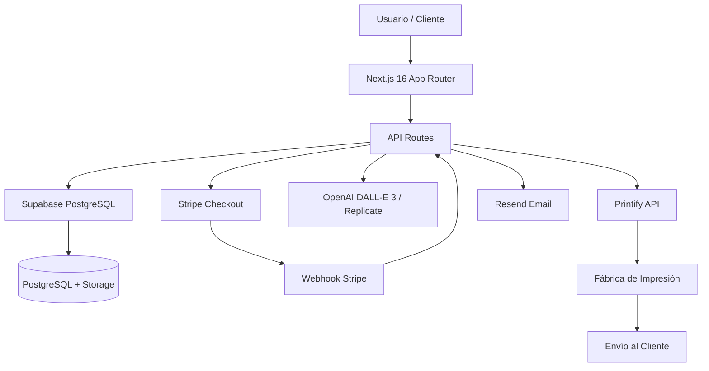
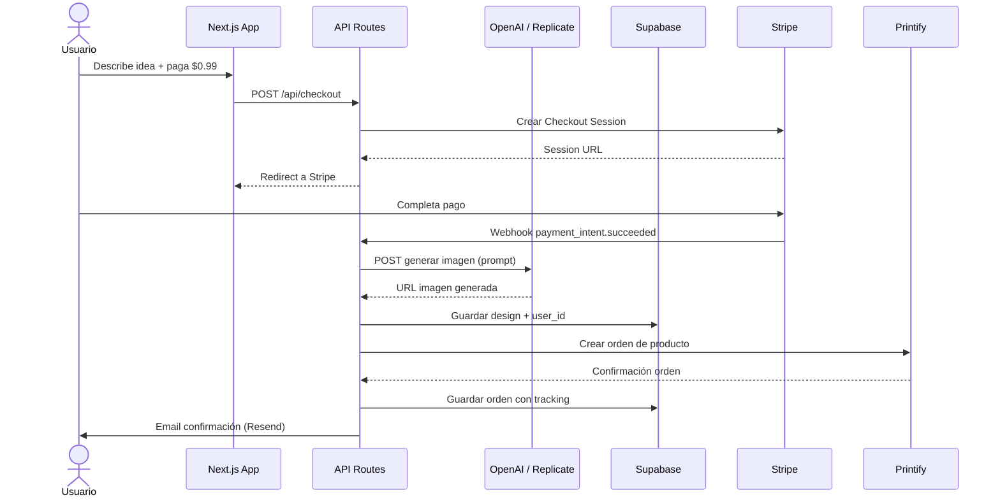

# PROJECT_DNA_EXPERIMENTOPROMPT.md

> **Propósito:** Mapa genético del proyecto experimentoprompt (producto: pod-ia-platform). Documenta objetivos, arquitectura, módulos, patrones, dependencias y estado actual para que cualquier IA o desarrollador pueda operar sin preguntar.
> **Última actualización:** 2026-06-03
> **Siguiendo:** Knowledge Refresh Protocol (`protocols/knowledge-refresh.md`)
> **Fuente de verdad:** `projects/experimentoprompt/AGENTS.md`, `projects/experimentoprompt/package.json`, `projects/experimentoprompt/docs/playbook-pod-ia.md`

---

## Tabla de Contenidos

1. [Objetivos](#1-objetivos)
2. [Arquitectura General](#2-arquitectura-general)
3. [Módulos](#3-módulos)
4. [Patrones](#4-patrones)
5. [Dependencias](#5-dependencias)
6. [Sistemas Reutilizables](#6-sistemas-reutilizables)
7. [Mapa de Archivos Críticos](#7-mapa-de-archivos-críticos)
8. [Estado Actual](#8-estado-actual)
9. [Capacidades](#9-capacidades)
10. [Cuellos de Botella](#10-cuellos-de-botella)

---

## 1. Objetivos

- **Crear una plataforma de Print on Demand (POD) automatizada** donde usuarios describan ideas y reciban productos físicos impresos sin intervención humana.
- **Generar diseños personalizados con IA** utilizando DALL-E 3 (OpenAI) o Stable Diffusion XL (Replicate) a partir de prompts de usuarios.
- **Automatizar el flujo de producción y envío** mediante integración directa con Printify API.
- **Monetizar mediante micro-pagos:** $0.99 por generación de diseño (reembolsable si compra) + markup del 60% sobre costo de producción.
- **Ofrecer una experiencia web fluida** con dashboard protegido, historial de diseños y tracking de órdenes.

---

## 2. Arquitectura General

### Principios de Diseño

| Principio | Aplicación |
|---|---|
| **Full-Stack Unificado** | Next.js 16 App Router combina frontend y backend en un solo deployable, reduciendo complejidad de infraestructura. |
| **Server Components por Defecto** | Solo se usan Client Components cuando se requiere interactividad, hooks o useEffect, optimizando performance y SEO. |
| **API-First Externo** | Todas las integraciones críticas (pagos, impresión, IA, auth) consumen APIs REST de terceros vía wrappers en `lib/`. |
| **Validación Estricta** | Todo input de API Routes validado con Zod antes de procesamiento. |
| **Sin Estado Local Persistente** | Estado de sesión manejado por Supabase Auth; estado de UI por React Server Components y props drilling limitado. |

### Diagrama de Capas

### Data Flow Principal (Generación + Compra)

---

## 3. Módulos

### Frontend / Marketing

| Módulo | Path | Descripción | Stack |
|---|---|---|---|
| Landing Page | `app/(marketing)/` | Página de aterrizaje, explica el modelo, CTA a signup | Next.js 16, React 19, Tailwind 4 |
| Dashboard Protegido | `app/(dashboard)/` | Área privada post-auth: generar, ver diseños, ver órdenes | Next.js 16 App Router, Server Components |
| Generar Diseño | `app/(dashboard)/generar/` | Formulario de prompt + preview + pago $0.99 | React Client Components, Zod |
| Historial Diseños | `app/(dashboard)/disenos/` | Galería de diseños generados por el usuario | Server Components + Supabase SSR |
| Estado Órdenes | `app/(dashboard)/ordenes/` | Tracking de órdenes Printify | Server Components |

### API / Backend

| Módulo | Path | Descripción | Stack |
|---|---|---|---|
| Generación IA | `app/api/generate/route.ts` | POST → OpenAI DALL-E 3 o Replicate SDXL | Next.js API Route, OpenAI SDK, Zod |
| Checkout Stripe | `app/api/checkout/route.ts` | POST → Stripe Checkout Session | Next.js API Route, Stripe Node SDK |
| Webhook Stripe | `app/api/webhooks/stripe/route.ts` | POST → Confirma pago, dispara generación y orden Printify | Next.js API Route, Zod, HMAC verification |
| Orden Printify | `app/api/printify/order/route.ts` | POST → Crea orden de producto físico en Printify | Next.js API Route, fetch |

### Componentes Compartidos

| Módulo | Path | Descripción | Stack |
|---|---|---|---|
| UI Base | `components/ui/` | Button, Input, Card (componentes atómicos) | React 19, Tailwind 4, TypeScript |
| Productos | `components/products/` | ProductCard, ProductSelector | React 19 |
| Diseño | `components/design/` | DesignPreview, MockupViewer | React 19, Client Components |
| Checkout | `components/checkout/` | StripePayment, CheckoutForm | React 19, Stripe Elements |

### Servicios / Librerías

| Módulo | Path | Descripción | Stack |
|---|---|---|---|
| Cliente Stripe | `lib/stripe.ts` | Cliente Stripe.js + configuración de claves | Stripe SDK |
| Cliente Supabase | `lib/supabase.ts` | Cliente SSR y cliente anónimo para auth + DB | Supabase SSR, Supabase JS |
| Cliente Printify | `lib/printify.ts` | Wrapper REST para Printify API | fetch, TypeScript |
| Cliente IA | `lib/ai.ts` | Wrapper para OpenAI DALL-E 3 y Replicate | OpenAI SDK, fetch |
| Pricing | `lib/pricing.ts` | Configuración de productos, costos, markup, precios finales | TypeScript |

### Infraestructura / DevOps

| Módulo | Path | Descripción | Stack |
|---|---|---|---|
| Supabase Migrations | `supabase/` | Migraciones y políticas RLS de la base de datos | Supabase CLI, PostgreSQL |
| Types | `types/index.ts` | Tipos compartidos (Design, Order, User, Product) | TypeScript strict |

---

## 4. Patrones

### Arquitectónicos

| Patrón | Implementación | Ubicación |
|---|---|---|
| **App Router (File-based routing)** | Next.js 16 convenciones de carpetas: `(marketing)`, `(dashboard)`, `api/` | `app/` |
| **Route Groups** | Grupos `(marketing)` y `(dashboard)` con layouts diferenciados | `app/(marketing)/`, `app/(dashboard)/` |
| **API Routes as BFF** | Backend for Frontend: toda la lógica de negocio vive en API Routes que consumen servicios externos | `app/api/*` |

### Diseño

| Patrón | Implementación | Ubicación |
|---|---|---|
| **Server Components por Defecto** | Cada archivo `.tsx` es Server Component salvo que use `"use client"` | Todo `app/` excepto componentes interactivos |
| **Client Components Aislados** | Solo cuando se necesita estado local, hooks o event handlers | `components/design/`, `components/checkout/` |
| **Props tipadas con Interface** | `interface ComponentProps { ... }` en vez de `type` | Todos los componentes en `components/` |

### Frontend

| Patrón | Implementación | Ubicación |
|---|---|---|
| **Kebab-case archivos, PascalCase componentes** | Archivos: `design-preview.tsx`, Export: `DesignPreview` | `components/` |
| **Tailwind CSS Utility-First** | Clases utilitarias inline, sin CSS Modules ni styled-components | Todo el proyecto |
| **Path Alias `@/*`** | Importaciones relativas simplificadas vía `tsconfig.json` paths | `tsconfig.json` |

### Datos

| Patrón | Implementación | Ubicación |
|---|---|---|
| **Zod Validation** | Todo input de API Routes validado antes de procesamiento | `app/api/*/route.ts` |
| **Row Level Security (RLS)** | Políticas por `user_id` en Supabase, cada usuario solo ve sus datos | Supabase Console / `supabase/` |
| **Webhook Idempotencia** | Stripe webhooks verificados con firma HMAC, evitar órdenes duplicadas | `app/api/webhooks/stripe/` |

---

## 5. Dependencias

### Producción

| Categoría | Dependencia | Versión | Propósito |
|---|---|---|---|
| Framework | `next` | 16.2.6 | Framework full-stack React con App Router |
| Framework | `react` / `react-dom` | 19.2.4 | UI library |
| Auth + DB | `@supabase/ssr` | 0.10.3 | Supabase SSR helpers para Next.js App Router |
| Auth + DB | `@supabase/supabase-js` | 2.106.2 | Cliente Supabase para PostgreSQL y Auth |
| Pagos | `@stripe/stripe-js` | 9.7.0 | Cliente Stripe para frontend (Checkout) |
| Pagos | `stripe` | 22.2.0 | SDK Stripe para backend (Node.js) |
| IA | `openai` | 6.39.1 | Cliente OpenAI para DALL-E 3 |
| Email | `resend` | 6.12.4 | Envío de emails transaccionales |
| Validación | `zod` | 4.4.3 | Validación de schemas (API input) |

### Desarrollo

| Categoría | Dependencia | Versión | Propósito |
|---|---|---|---|
| Lenguaje | `typescript` | 5.x | Type checking estricto |
| Styling | `tailwindcss` | 4.x | CSS utility-first |
| Linting | `eslint` | 9.x | Linter de código |
| Linting | `eslint-config-next` | 16.2.6 | Configuración ESLint para Next.js |
| Types | `@types/node`, `@types/react`, `@types/react-dom` | 20, 19, 19 | Tipos de TypeScript |
| Types | `@types/stripe` | 8.0.416 | Tipos legacy de Stripe (⚠️ posiblemente redundante) |

---

## 6. Sistemas Reutilizables

| Sistema | Descripción | Reutilizable en |
|---|---|---|
| `lib/stripe.ts` | Cliente Stripe inicializado con claves de entorno, métodos para crear sessions y verificar webhooks | Cualquier proyecto con pagos Stripe |
| `lib/supabase.ts` | Cliente SSR + anónimo, maneja cookies de auth, conexión a PostgreSQL | Cualquier proyecto con Supabase |
| `lib/ai.ts` | Abstracción de generación de imágenes: unifica OpenAI y Replicate bajo una interfaz común | Cualquier proyecto con generación de imágenes |
| `lib/pricing.ts` | Configuración de productos, cálculo de markup y precios finales | Cualquier proyecto de e-commerce/POD |
| `lib/printify.ts` | Cliente REST para Printify: crear productos, órdenes, tracking | Cualquier proyecto con Printify |
| `types/index.ts` | Tipos compartidos: User, Design, Order, Product, etc. | Todo el proyecto y APIs externas |

---

## 7. Mapa de Archivos Críticos

| Archivo | Propósito | Si se rompe... |
|---|---|---|
| `app/layout.tsx` | Layout raíz, providers, metadata | Toda la app no carga |
| `app/api/generate/route.ts` | Generación de imágenes con IA | Usuarios no pueden crear diseños |
| `app/api/checkout/route.ts` | Creación de Stripe Checkout Sessions | No se procesan pagos |
| `app/api/webhooks/stripe/route.ts` | Recepción y verificación de webhooks Stripe | Pagos confirmados no generan órdenes (pérdida de revenue) |
| `app/api/printify/order/route.ts` | Creación de órdenes en Printify | Productos no se imprimen ni envían |
| `lib/stripe.ts` | Configuración y cliente Stripe | Toda la lógica de pagos falla |
| `lib/supabase.ts` | Cliente de base de datos y auth | Sin auth, sin datos, sin storage |
| `lib/ai.ts` | Cliente de generación de imágenes | Sin generación de diseños |
| `lib/pricing.ts` | Configuración de productos y precios | Precios incorrectos o pérdida de margen |
| `types/index.ts` | Tipos compartidos del dominio | TypeScript errors en todo el proyecto |
| `.env.local` | Variables de entorno (API keys) | Todas las integraciones externas fallan |
| `next.config.ts` | Configuración de Next.js | Build falla o comportamiento inesperado |

---

## 8. Estado Actual

| Aspecto | Estado | Notas |
|---|---|---|
| Tests | ❌ Sin framework | No hay vitest, jest, playwright ni pytest configurados |
| Build | ⚪ Desconocido | `npm run build` no ejecutado recientemente en este contexto |
| Lint | ⚪ Desconocido | ESLint 9 configurado pero sin reporte reciente |
| TypeCheck | ⚪ Desconocido | `tsc --noEmit` configurado, estado no verificado |
| CI/CD | ❌ Sin pipeline | Sin `.github/workflows/`, Jenkins, ni similar |
| Docker | ❌ Sin containerización | Sin Dockerfile ni docker-compose |
| Documentación | ✅ Completa | `AGENTS.md` detallado + `docs/playbook-pod-ia.md` (1011 líneas) |
| Dependencias desactualizadas | ⚪ Desconocido | Sin `npm audit` reciente |
| Auth | ✅ Implementado | Supabase Auth + Google OAuth configurados |
| Pagos | ✅ Implementado | Stripe Checkout + Webhooks integrados |
| Generación IA | ✅ Implementado | OpenAI DALL-E 3 + Replicate SDXL |
| Impresión POD | ✅ Implementado | Printify API integrada |

---

## 9. Capacidades

| Capacidad | Descripción | Estado |
|---|---|---|
| Autenticación de usuarios | Login/signup vía Google OAuth con Supabase Auth | ✅ Implementado |
| Generación de diseños con IA | Prompt → imagen personalizada vía DALL-E 3 o Replicate | ✅ Implementado |
| Micro-pagos | Cobro de $0.99 por generación + checkout de producto vía Stripe | ✅ Implementado |
| Webhooks de pago | Recepción automática de confirmaciones Stripe para disparar flujo | ✅ Implementado |
| Impresión y envío automatizado | Creación de órdenes en Printify sin intervención humana | ✅ Implementado |
| Historial de diseños | Usuarios pueden ver y gestionar sus diseños generados | ✅ Implementado |
| Tracking de órdenes | Estado de órdenes Printify en dashboard del usuario | ✅ Implementado |
| Emails transaccionales | Confirmaciones y notificaciones vía Resend | ⚪ Parcial (skill email existe) |
| Rate limiting en IA | Máximo 5 generaciones/minuto por usuario | ⚪ Parcial (documentado, sin implementar) |
| SEO y marketing | Landing page optimizada para conversión | ⚪ Parcial |
| Tests automatizados | Cobertura de unit, integration y e2e tests | ❌ Pendiente |
| CI/CD | Build, test y deploy automáticos | ❌ Pendiente |

---

## 10. Cuellos de Botella

| Cuello | Severidad | Descripción | Plan de mitigación |
|---|---|---|---|
| Sin framework de tests | 🔴 Crítico | Sin tests automatizados, cada cambio es riesgoso. Regression bugs probables en webhooks y pagos. | Instalar Vitest + React Testing Library + Playwright. Empezar con tests de API routes (checkout, webhooks). |
| Dependencia de 4+ APIs externas | 🟡 Importante | Stripe, Printify, OpenAI, Supabase. Cualquier outage o breaking change afecta el core del negocio. | Implementar circuit breakers, retries con backoff, y monitoreo de health de cada API. |
| Sin CI/CD | 🟡 Importante | Deploys manuales, sin validación automática de build/lint/tests antes de producción. | Configurar GitHub Actions: lint → typecheck → build → deploy Vercel. |
| Sin Docker | 🟡 Importante | Imposible reproducir entorno de producción localmente. Onboarding de nuevos devs lento. | Crear Dockerfile para Next.js + docker-compose con servicios mock. |
| Rate limiting manual en IA | 🟡 Importante | Documentado "5 gen/min" pero sin implementación técnica verificada. Riesgo de costos excesivos por abuso. | Implementar rate limiting con Redis o Supabase + middleware en API Routes. |
| `@types/stripe` redundante | 🟢 Menor | Stripe Node SDK ya incluye tipos nativos. `@types/stripe` legacy puede generar conflictos. | Eliminar `@types/stripe` de devDependencies. |

---

*Fin de PROJECT_DNA_EXPERIMENTOPROMPT.md — Mapa genético del ecosistema.*
