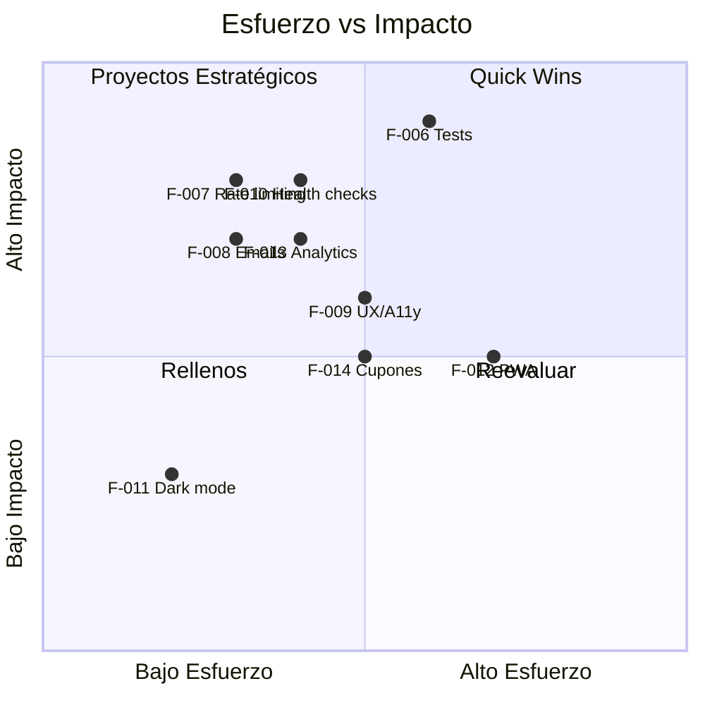

# PRODUCT_BACKLOG.md — experimentoprompt (pod-ia-platform)

> **Propósito:** Inventario priorizado de features y user stories.
> **Fuente:** ROADMAP.md + PROJECT_DNA_EXPERIMENTOPROMPT.md (Capacidades, Cuellos de Botella)
> **Última actualización:** 2026-06-03
> **Revisar cada:** Semana (sprint planning)

---

## Resumen de Prioridades

| Prioridad | Cantidad | % del Backlog |
|---|---|---|
| 🔴 Must have | 5 | 31% |
| 🟡 Should have | 5 | 31% |
| 🟢 Could have | 4 | 25% |
| ⚪ Won't have (now) | 2 | 13% |

---

## 🔴 Must Have (MVP — Core del Negocio)

| ID | Feature / User Story | Milestone | Capacidad | Cuello que resuelve | Estado |
|---|---|---|---|---|---|
| F-001 | Como usuario, quiero iniciar sesión con Google para acceder a mi dashboard | Auth + Supabase | Autenticación | — | ✅ Completado |
| F-002 | Como usuario, quiero describir una idea para que la IA genere un diseño personalizado | Generación IA | Generación de diseños | — | ✅ Completado |
| F-003 | Como usuario, quiero pagar $0.99 para generar un diseño de alta calidad | Checkout + Webhooks | Micro-pagos | — | ✅ Completado |
| F-004 | Como usuario, quiero que mi diseño se imprima y envíe automáticamente tras el pago | Automatización Printify | Impresión y envío automatizado | — | ✅ Completado |
| F-005 | Como usuario, quiero ver mis diseños generados y el estado de mis órdenes | Dashboard + Historial | Historial + Tracking | — | ✅ Completado |

---

## 🟡 Should Have (Calidad y Confiabilidad)

| ID | Feature / User Story | Milestone | Capacidad | Cuello que resuelve | Estado |
|---|---|---|---|---|---|
| F-006 | Implementar tests unitarios e integración para API routes críticas (checkout, webhooks, generate) | Tests automatizados | Tests automatizados | Sin framework de tests | ⚪ Pendiente |
| F-007 | Limitar generaciones de IA a 5 por minuto por usuario con persistencia | Rate limiting robusto | Rate limiting en IA | Rate limiting manual | ⚪ Pendiente |
| F-008 | Enviar email de confirmación de compra y tracking de envío al usuario | Email notifications | Emails transaccionales | Emails parciales | ⚪ Pendiente |
| F-009 | Mejorar responsive y accesibilidad (a11y) en todas las páginas públicas | UX / Accesibilidad | SEO y marketing | UX parcial | ⚪ Pendiente |
| F-010 | Implementar monitoreo de health de APIs externas (Stripe, Printify, OpenAI, Supabase) | CI/CD pipeline | — | Dependencia de APIs externas | ⚪ Pendiente |

---

## 🟢 Could Have (Nice-to-have)

| ID | Feature / User Story | Milestone | Capacidad | Cuello que resuelve | Estado |
|---|---|---|---|---|---|
| F-011 | Dark mode toggle en el dashboard | UX / Accesibilidad | — | — | ⚪ Pendiente |
| F-012 | PWA: Service Worker para offline browsing de diseños generados | UX / Accesibilidad | — | — | ⚪ Pendiente |
| F-013 | Analytics de conversión: tracking de funnel (landing → signup → generación → compra) | Launch | SEO y marketing | — | ⚪ Pendiente |
| F-014 | Sistema de cupones y descuentos promocionales | Polish | Micro-pagos | — | ⚪ Pendiente |

---

## ⚪ Won't Have (Now)

| ID | Feature / User Story | Razón | Reevaluar en |
|---|---|---|---|
| F-015 | Aplicación móvil nativa (iOS/Android) | Fuera del scope MVP. La web es PWA-ready con responsive. | Post-launch (Q3 2026) |
| F-016 | Marketplace multi-vendedor (usuarios venden sus propios diseños) | Complejidad alta. Requiere rediseño de arquitectura de órdenes y pagos. | Post-launch (Q4 2026) |

---

## Matriz de Esfuerzo vs Impacto

---

## Historial de Cambios

| Fecha | Cambio | Autor |
|---|---|---|
| 2026-06-03 | Backlog inicial generado desde ROADMAP | AI_OPERATING_SYSTEM / onboard-project |

---

*Fin de PRODUCT_BACKLOG.md — Inventario de features de experimentoprompt (pod-ia-platform).*
