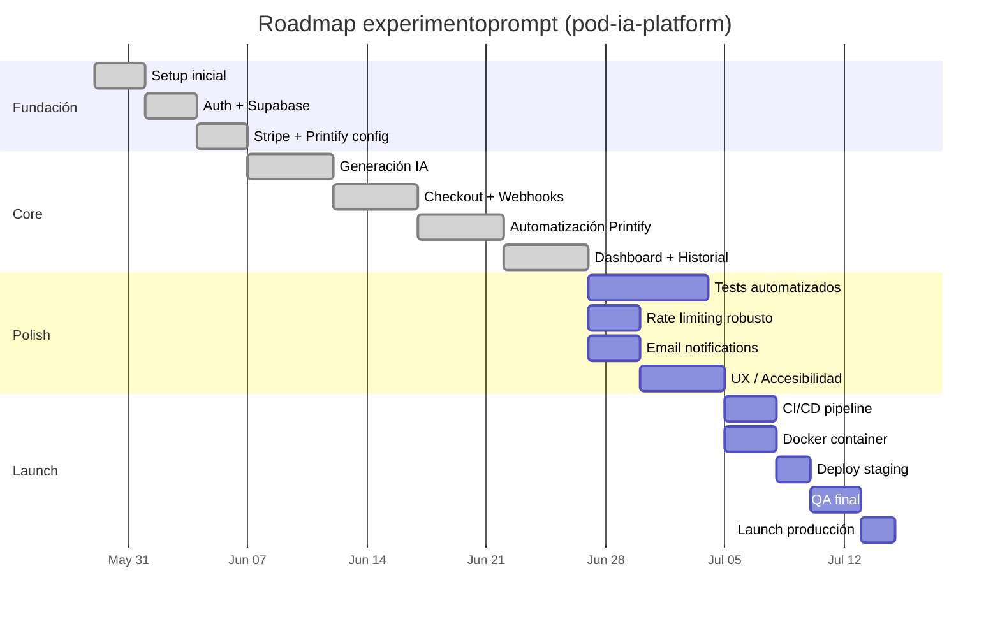
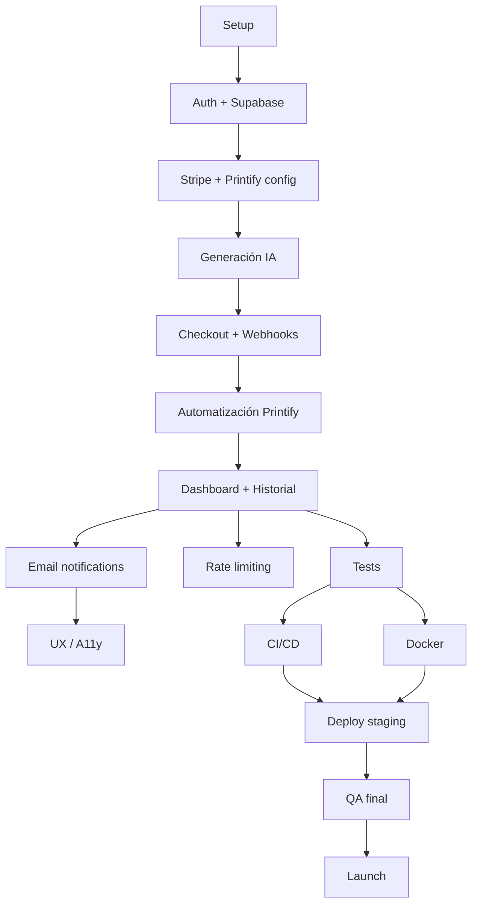

# ROADMAP.md — experimentoprompt (pod-ia-platform)

> **Propósito:** Plan de desarrollo con milestones, dependencias y timeline.
> **Fuente:** PROJECT_DNA_EXPERIMENTOPROMPT.md — Sección 1 (Objetivos) + Sección 10 (Cuellos de Botella)
> **Última actualización:** 2026-06-03
> **Revisar cada:** 2 semanas

---

## Timeline Visual

---

## Milestones

| # | Milestone | Objetivo | Fase | Dependencias | Estado |
|---|---|---|---|---|---|
| 1 | Setup inicial | Configurar Next.js 16, TypeScript strict, Tailwind 4, estructura de carpetas | Fundación | — | ✅ Completado |
| 2 | Auth + Supabase | Implementar login/signup con Google OAuth y base de datos | Fundación | #1 | ✅ Completado |
| 3 | Stripe + Printify config | Configurar claves, webhooks, y clientes de pago e impresión | Fundación | #2 | ✅ Completado |
| 4 | Generación IA | Integrar OpenAI DALL-E 3 y Replicate SDXL para generar imágenes | Core | #3 | ✅ Completado |
| 5 | Checkout + Webhooks | Implementar Stripe Checkout Sessions y webhook handler con HMAC | Core | #4 | ✅ Completado |
| 6 | Automatización Printify | Crear órdenes automáticas en Printify tras confirmación de pago | Core | #5 | ✅ Completado |
| 7 | Dashboard + Historial | UI de historial de diseños y tracking de órdenes para usuarios | Core | #6 | ✅ Completado |
| 8 | Tests automatizados | Instalar Vitest + RTL + Playwright, cubrir API routes y flujo crítico | Polish | #7 | 🔵 En progreso |
| 9 | Rate limiting robusto | Implementar límite de 5 gen/min con persistencia (Redis/Supabase) | Polish | #7 | ⚪ Pendiente |
| 10 | Email notifications | Confirmaciones de compra y envío vía Resend | Polish | #7 | ⚪ Pendiente |
| 11 | UX / Accesibilidad | Mejorar responsive, a11y, animaciones, empty states | Polish | #10 | ⚪ Pendiente |
| 12 | CI/CD pipeline | GitHub Actions: lint → typecheck → test → build → deploy Vercel | Launch | #8 | ⚪ Pendiente |
| 13 | Docker container | Dockerfile + docker-compose para reproducibilidad | Launch | #8 | ⚪ Pendiente |
| 14 | Deploy staging | Ambiente de staging en Vercel con variables de entorno separadas | Launch | #12 | ⚪ Pendiente |
| 15 | QA final | Testing manual end-to-end, validación de webhooks, edge cases | Launch | #14 | ⚪ Pendiente |
| 16 | Launch producción | Deploy a Vercel producción, monitorización básica | Launch | #15 | ⚪ Pendiente |

---

## Dependencias Entre Milestones

---

## Criterios de Éxito por Fase

### Fundación
- [x] Repositorio configurado con `.gitignore`, `README.md`
- [x] Next.js 16 con TypeScript strict y Tailwind 4
- [x] Supabase Auth funcional con Google OAuth
- [x] Variables de entorno configuradas (`.env.local`)

### Core
- [x] Flujo de generación de diseño: prompt → imagen → preview → pago
- [x] Stripe Checkout Session crea pago y redirige
- [x] Webhook Stripe confirma pago y dispara orden Printify
- [x] Dashboard muestra historial de diseños y órdenes del usuario autenticado

### Polish
- [ ] Cobertura de tests > 70% en API routes críticas (checkout, webhooks, generate)
- [ ] Rate limiting funcional y probado (rechaza > 5 req/min)
- [ ] Emails transaccionales enviados y recibidos correctamente
- [ ] Lighthouse score > 90 en todas las páginas públicas
- [ ] 0 vulnerabilidades críticas o altas en `npm audit`

### Launch
- [ ] Pipeline CI/CD ejecuta lint + typecheck + tests en cada PR
- [ ] Docker build exitoso en local
- [ ] Deploy a staging automático desde `main`
- [ ] QA manual aprobado: flujo completo de usuario, edge cases de pagos
- [ ] Monitoreo básico configurado (Vercel Analytics + Stripe Dashboard)

---

## Historial de Cambios

| Fecha | Cambio | Autor |
|---|---|---|
| 2026-06-03 | Roadmap inicial generado desde PROJECT_DNA | AI_OPERATING_SYSTEM / onboard-project |

---

*Fin de ROADMAP.md — Plan de desarrollo de experimentoprompt (pod-ia-platform).*
